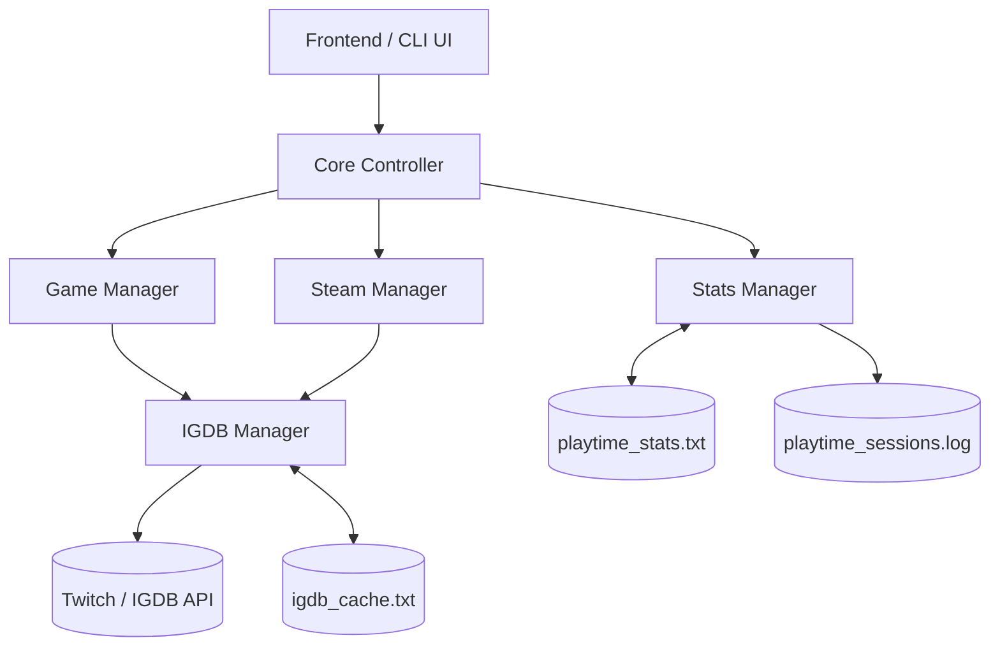

# Vortex Launcher - System Architecture Overview

This document provides a high-level architectural overview of the **Vortex Game Launcher** backend. It is designed to help UI/Frontend developers understand the core components, data flow, and how a future Graphical User Interface (GUI) can integrate with the existing C++ engine.

---

## 1. High-Level Architecture

Vortex is currently a lightweight, highly-optimized C++ console application. It serves as a unified launcher that automatically discovers, tracks, and launches both standalone local games and Steam games. 

The architecture is strictly modular, separating library discovery, external API communication, and analytics into distinct "Managers."



---

## 2. Core Components

### `main.cpp` (The Controller)
* **Current Role:** Acts as the CLI frontend and the core router. It handles the main loop, prompts the user for their mood, and routes them to either the Steam Library or Local Library.
* **Frontend Integration:** When moving to a GUI, the logic in `main.cpp` should be stripped of `std::cout`/`std::cin` and converted into a Controller layer that the GUI communicates with (e.g., via IPC, FFI, or a shared library interface).

### `game_manager.h / .cpp` (Local Library)
* **Role:** Discovers local, DRM-free games.
* **Mechanism:** Recursively scans specific configured directories (e.g., `E:\Games`) looking for executables. It parses folder names and uses process monitoring (`CreateProcessW`, `WaitForSingleObject`) to track exactly when a local game is launched and closed.

### `steam_manager.h / .cpp` (Steam Integration)
* **Role:** Interfaces with the local Steam installation.
* **Mechanism:** Reads the Windows Registry to locate the Steam installation path. It parses Valve's VDF format (`libraryfolders.vdf` and `appmanifest_*.acf`) to instantly discover installed Steam games without requiring a network connection. It uses `steam://run/<AppID>` to launch games and utilizes Process Snapshotting (`TlHelp32.h`) to poll and track Steam game lifespans.

### `igdb_manager.h / .cpp` (Metadata & Resolution)
* **Role:** Standardizes game names and fetches canonical IDs.
* **Mechanism:** Communicates with the Twitch/IGDB API (v4) over HTTPS. It takes raw folder names or Steam manifest names and resolves them to their official industry titles.
* **Optimization:** Features a robust, file-backed caching layer (`igdb_cache.txt`) to ensure lightning-fast boot times and zero API rate-limiting issues on subsequent launches.

### `stats_manager.h / .cpp` (Analytics & Telemetry)
* **Role:** Handles all playtime tracking.
* **Mechanism:** Exposes a simple `record_play_session()` API. It maintains two distinct storage mediums:
  1. A fast O(1) key-value store for total playtime.
  2. An append-only ledger for individual timestamped play sessions.

### `metadata_manager.h / .cpp (Metadata storage for faster access)`

- **Role:** Stores the game's metdata in the following fields -
  
  IGDB_ID=Developer|Rating|Time_To_Beat_Seconds|All_Genres|Main_Genres(for ML use)

	Metadata is stored in game_metadata.txt

- **Mechanism:** 

---

## 3. Data Persistence & Storage

Vortex uses flat text files for maximum performance, portability, and user-readability. A frontend application must be aware of these files if it wishes to read data directly.

| File | Purpose | Format |
|---|---|---|
| `igdb_cache.txt` | Caches API responses to prevent network calls. | `QUERY=ID|CANONICAL_NAME` |
| `playtime_stats.txt` | Stores cumulative total playtime. | `GAME_KEY=TOTAL_SECONDS` |
| `playtime_sessions.log`| Append-only ledger of exact game sessions. | `KEY|NAME|DURATION|START_DATE|END_DATE` |

*(Note: `GAME_KEY` intelligently maps to either an `igdb_XXXX`, `steam_XXXX`, or `local_XXXX` identifier to ensure 100% accurate tracking even for unrecognized indie games).*

---

## 4. Considerations for the Frontend Developer

As you begin designing the UI (whether using Qt, ImGui, Electron, or another framework), keep the following backend constraints and capabilities in mind:

> [!TIP]
> **Asynchronous Operations**
> The IGDB API lookups and local directory scanning can take a few seconds on a fresh boot (before the cache is populated). The frontend should be prepared to show a loading state or skeleton UI while the backend populates the library arrays.

> [!IMPORTANT]
> **Process Blocking**
> Currently, the backend strictly blocks and tracks the lifecycle of a game process when it is launched. The GUI must ensure that launching a game does not freeze the main UI thread. The backend launch mechanisms (`launchGame` and `launch_steam_game_by_appid`) should be executed on a separate thread or converted to async tasks.

> [!NOTE]
> **Modular Metadata**
> The backend was recently experimented on to fetch expanded metadata (Developers, Ratings, Time to Beat). While the data models support expansion, the current production build focuses strictly on IDs, Names, and Playtime. The UI should be designed flexibly to accommodate richer metadata drops in the future.

---

# Function Wise

## 1. Local Library Management (`game_manager.h`)

This module handles discovering and tracking local, DRM-free games located in explicitly configured directories.

### Data Structures
```cpp
struct temp_GameEntry {
  std::string name;        // Canonical or raw name of the game
  fs::path gamePath;       // Absolute path to the main executable
  long long igdb_id = 0;   // 0 if unrecognized, otherwise the official IGDB ID
};
```

### Core Functions

* **`void scan_directory_for_games(const fs::path &gameDir, std::vector<temp_GameEntry> &outGames)`**
  * **Description:** Recursively scans `gameDir` for subdirectories, identifying the largest `.exe` inside each as the main game executable. It instantly passes the folder name to the `igdb_manager` to populate `name` and `igdb_id`.
  * **Variables:** Mutates the passed `outGames` vector.
  * **Frontend Note:** This is heavily synchronous and involves network API calls (if the IGDB cache is empty). Execute this asynchronously in the GUI to prevent locking.

* **`int launchGame(const fs::path &gamePath)`**
  * **Description:** Spawns a new process using the Windows `CreateProcessW` API. It then uses `WaitForSingleObject` to halt the calling thread until the game exits.
  * **Returns:** The integer exit code of the game (0 typically means clean exit).
  * **Frontend Note:** Because it blocks the thread indefinitely while the user plays, a GUI *must* call this on a background thread so the launcher UI remains responsive.

* **`bool is_game_running_in_dir(const fs::path &installDir)`**
  * **Description:** Utilizes Windows `TlHelp32.h` to snapshot all running processes and checks if any executable originating from `installDir` is currently active.

---

## 2. Steam Integration (`steam_manager.h`)

This module is completely decoupled from the Steamworks SDK. It discovers and launches games strictly via local system files and URL protocols.

### Data Structures
```cpp
struct SteamGame {
	int appid = 0;                 // Steam Application ID
	std::string name;              // Official name parsed from the ACF manifest
	fs::path libraryPath;          // The Steam Library root (e.g., C:\Program Files (x86)\Steam)
	fs::path installDir;           // Absolute path to the game's installation folder
	fs::path manifestPath;         // Path to the specific appmanifest_*.acf file
	long long igdb_id = 0;         // IGDB ID resolved via the IGDB Manager
};
```

### Core Functions

* **`std::vector<SteamGame> read_installed_steam_games()`**
  * **Description:** Reads the Windows Registry to locate Steam. Parses `libraryfolders.vdf` to find all active steam libraries across multiple hard drives. It then parses `appmanifest_*.acf` files in those libraries to extract installed games, AppIDs, and names.
  * **Returns:** A dynamically allocated vector of all discovered Steam games.

* **`bool launch_steam_game_by_appid(int appid)`**
  * **Description:** Executes `ShellExecuteW` with the protocol `steam://run/<appid>`. 
  * **Frontend Note:** Unlike local games, Steam manages the process. The backend relies on `is_game_running_in_dir()` polling to determine when a Steam game actually closes.

---

## 3. Metadata & Identification (`igdb_manager.h`)

This module handles API communication with the Twitch IGDB servers to normalize game titles.

### Data Structures
```cpp
struct IgdbGameInfo {
  std::string name;       // The canonical, official name (e.g., "Grand Theft Auto V")
  long long id = 0;       // The official IGDB Database ID
};
```

### Core Functions

* **`IgdbGameInfo igdb_resolve_game(const std::string &folderName, bool interactive = true)`**
  * **Description:** Takes a raw string (`folderName`) and attempts to match it against the IGDB API. 
  * **Caching:** Before hitting the network, it reads `igdb_cache.txt`. If the name was previously resolved, it returns immediately.
  * **Parameters:** `interactive` determines if the backend should pause and prompt the user via CLI if no API match is found. 
  * **Frontend Note:** For a GUI, `interactive` should be set to `false`. Unrecognized games should be flagged so the UI can draw a "Fix Match" or "Link IGDB" button for the user to manually resolve later.

---

## 4. Analytics & Telemetry (`stats_manager.h`)

Handles all persistent I/O for user playtime tracking.

### Core Functions

* **`long long get_playtime(const std::string& game_key)`**
  * **Description:** Opens `playtime_stats.txt` (a rapid O(1) key-value text file) to fetch cumulative playtime.
  * **Parameters:** `game_key` is dynamically generated. Examples: `"igdb_11587"`, `"steam_400"`, `"local_mycustomgame"`.
  * **Returns:** Total time played in seconds.

* **`void record_play_session(const std::string& game_key, const std::string& game_name, std::time_t start_time, std::time_t end_time)`**
  * **Description:** Calculates the duration (`end_time` - `start_time`). It first updates `playtime_stats.txt` with the new cumulative total. Second, it appends a detailed ledger entry to `playtime_sessions.log`.
  * **Parameters:** Requires the standard UNIX timestamps from the `<ctime>` library. 
  * **Frontend Note:** A GUI could read `playtime_sessions.log` to build beautiful graphs showing what days of the week the user plays specific games.
