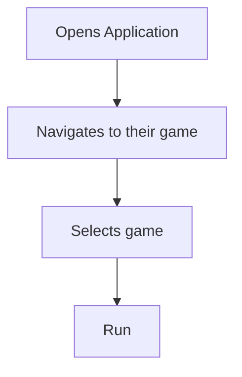
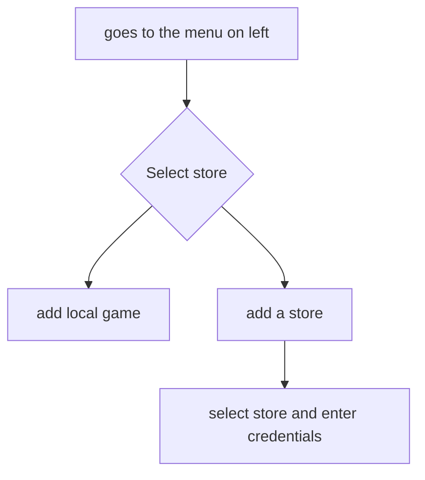
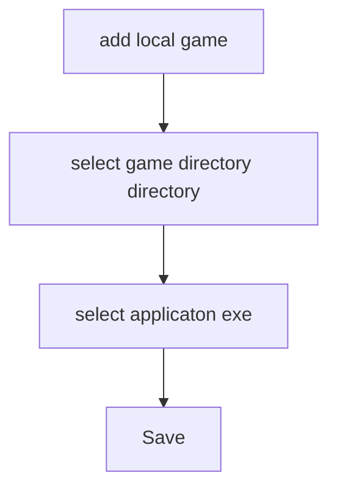

# Study 

# themes/palette
1. Paper
2. hanok
3. oblivion
   
# UI elements

## main page

1. Main Library - 
	1. Grid view (not selected)
		1. Cover art
		2. Name
	2. Grid View (selected)
		1. Cover Art
		2. Name
		3. Details like Genre
		4. publisher/distributor
		5. 
	3. List view (if)
		1. Cover art
		2. Name
		3. Installed/Not installed
		4. publisher/studio
		5. Distributor/platform
		6. Rating

2. Side Bar
	1. "Library"
		1. Stores and Distributor list
	2. Add more Libraries
	3. List
		1. Playing
		2. Completed
		3. Plan to play later
		4. On Hold
		5. Wish-listed
	4. Explore
		1. Recommendations
		2. Upcoming releases (in theory)
		3. deals(in theory)

3. Search Bar
	1. Recommended search
	2. selection

4. library type toggle and menu
	1. Size slider
	2. sort
		1. Date installed
		2. alphabetical
		3. release date
		4. recently played (default)
	3. reverse order

## Add platform window

1. username/email
2. password
3. selection 

# User flow 

## 1. The bare bone work flow 

## 2. The adding game work flow 

## 3. local game add workflow

